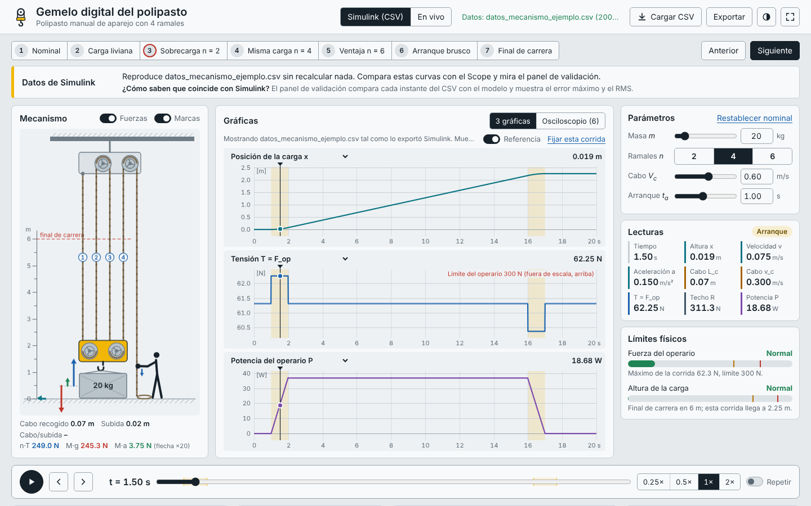
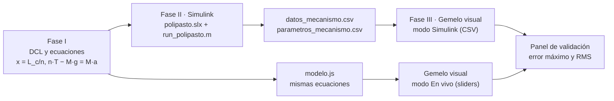
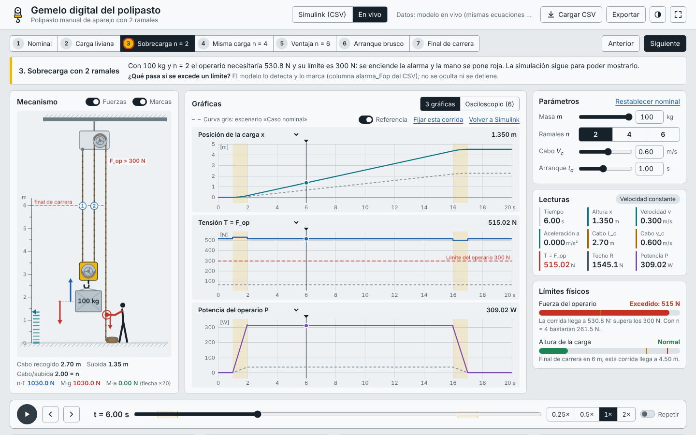

# Polipasto manual · Modelado, simulación y gemelo digital

Proyecto de aula de **Modelado y Simulación** (Universidad Popular del Cesar, 2026-2, docente Ing. Andrés Perpiñán Reyes).

Se modela un polipasto manual de aparejo con n = 2, 4 o 6 ramales, se simula en MATLAB/Simulink y se valida con un gemelo digital que corre en el navegador. El gemelo muestra el mecanismo, sus fuerzas y sus gráficas, todo sincronizado.



## Abrir el simulador en 30 segundos

1. Descarga el repositorio: botón verde **Code → Download ZIP** y descomprímelo, o `git clone https://github.com/dbernate2003/polipasto-modelado-simulacion.git`.
2. Abre `gemelo_visual/index.html` con doble clic. Funciona en Chrome o Edge **sin internet** y sin instalar nada.
3. Para validar contra Simulink, usa **Cargar CSV** y elige `datos_mecanismo.csv` y `parametros_mecanismo.csv` juntos (o arrástralos a la ventana). Para probar sin MATLAB, carga los dos archivos de `gemelo_visual/datos_ejemplo/`.

La guía para instalarlo paso a paso está en [`docs/Guia_instalacion_polipasto.docx`](docs/Guia_instalacion_polipasto.docx).

## Cómo encajan las tres fases



El gemelo **no inventa física propia**: `gemelo_visual/modelo.js` implementa exactamente las ecuaciones de `simulink/solucion_analitica.m`. Las pruebas de `verificacion/` lo comprueban.

## Estructura

```text
polipasto-modelado-simulacion/
├── simulink/                    Fase II (abre esta carpeta en MATLAB)
│   ├── parametros_polipasto.m   parámetros: m, n, Vc, ta (edita solo la sección 1)
│   ├── derivados_polipasto.m    M, A, tiempos del perfil, final de carrera y límites
│   ├── run_polipasto.m          simula y exporta datos_mecanismo.csv y parametros_mecanismo.csv
│   ├── exportar_csv.m           escribe los dos CSV (t [s] en la primera columna)
│   ├── comparar_solvers.m       ode45, ode23t, ode15s, ode4, ode1 y ode1be frente a la solución exacta
│   ├── correr_escenarios.m      n = 2, 4, 6, m = 100 kg y tope de 6 m → carpeta escenarios/
│   ├── solucion_analitica.m     solución exacta por tramos (para validar)
│   ├── construir_polipasto.m    respaldo: arma polipasto.slx por código
│   ├── contraste_scope_csv.ipynb  contraste en Python (como en los Talleres 2 y 3)
│   └── referencia_analitica_nominal.csv
├── gemelo_visual/               Fase III (abre index.html)
│   ├── index.html · estilos.css
│   ├── modelo.js                ecuaciones del modelo
│   ├── csv.js                   lectura y escritura de los CSV
│   ├── graficas.js              gráficas con cursor (canvas, sin librerías)
│   ├── mecanismo.js             dibujo del polipasto y de los DCL
│   ├── app.js                   interfaz, escenarios, validación
│   └── datos_ejemplo/           CSV de ejemplo para probar sin MATLAB
├── verificacion/                pruebas del modelo (Node) y del navegador (Playwright)
└── docs/                        guías y capturas
```

Cuando se corra Simulink aparecerán en `simulink/` el modelo `polipasto.slx`, `datos_mecanismo.csv`, `parametros_mecanismo.csv`, `comparacion_solvers.csv` y la carpeta `escenarios/`. Todos se suben al repositorio.

## El modelo en una pantalla

Hipótesis (nivel 1 ideal): cuerda inextensible y sin masa, poleas sin masa ni fricción, movimiento vertical, gravedad constante.

| Ecuación | De dónde sale |
|---|---|
| x = x₀ + L_c / n,  v = v_c / n,  a = a_c / n | Longitud total de cuerda constante |
| n·T − M·g = M·a  →  T = M(g + a)/n | Newton en la carga + bloque móvil |
| F_op = T | Polea ideal: misma tensión en el cabo libre |
| R = (n + 1)·T | Equilibrio del bloque fijo |
| P = F_op·v_c,  W_op = M·g·Δx + ½·M·v² | Potencia y trabajo-energía |

Espacio de estados: **x** = [x; v], u = a_c, ẋ = A**x** + Bu con A = [0 1; 0 0] y B = [0; 1/n]. Los autovalores son nulos, así que el sistema no es rígido: por eso se usa **ode45 de paso variable**, y `comparar_solvers.m` aporta la evidencia.

Entrada: el operario recoge cabo con un perfil trapezoidal (reposo 1 s, arranque t_a, crucero, frenado t_a). Si la carga fuera a pasar de 6 m, el frenado se adelanta (final de carrera).

## Qué hace el gemelo visual y qué criterio de la rúbrica cubre

| Criterio (peso) | Funciones del simulador |
|---|---|
| Entorno visual y gráfica sincronizada (25 %) | Mecanismo animado con la cuerda corriendo a su velocidad real; gráficas con cursor que se puede arrastrar; lecturas instantáneas; vista de osciloscopio con las 6 señales del Scope |
| Interactividad y control paramétrico (15 %) | Sliders y campos numéricos para m, n, V_c y t_a que recalculan al instante; 7 escenarios guiados; curva gris de referencia; velocidad de reproducción y teclado |
| Simulación, solver y CSV (20 %) | Lee `datos_mecanismo.csv` de Simulink y muestra el error máximo y el RMS frente al modelo; exporta cada corrida con el mismo formato |
| Modelado físico y matemático (25 %) | DCL en vivo de 4 cuerpos con flechas a escala; ecuaciones evaluadas con los números del instante; balance W_op = E_mec |
| Límites físicos | Alarma cuando F_op supera 300 N; final de carrera a 6 m; los controles no permiten estados imposibles |



## Pruebas

```bash
node verificacion/test_modelo.js            # modelo del gemelo frente a la Fase I y al CSV de referencia
python3 verificacion/verificar_modelo.py    # réplica en Python y CSV de referencia
python3 verificacion/prueba_navegador.py    # abre el simulador en Chromium (requiere playwright)
```

## Alcance

Es un modelo académico de nivel 1 (ideal). Sirve para estudiar la cinemática y las fuerzas del aparejo; no certifica un polipasto real, que además exige verificar resistencia, fatiga y las normas ASME B30.16 e ISO 16625.
